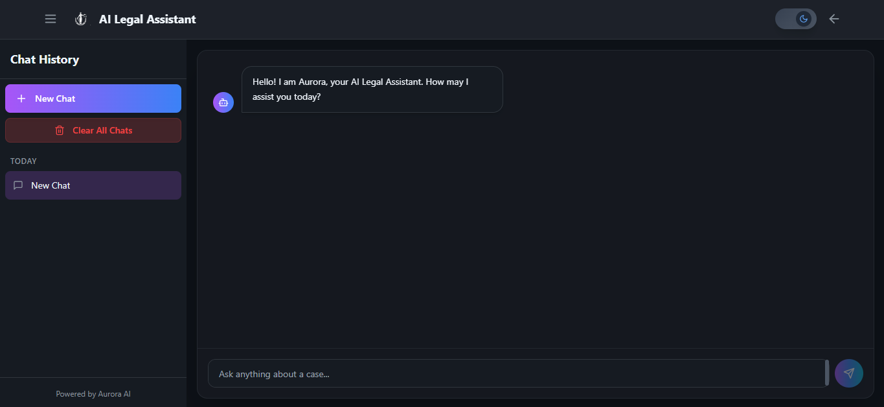

<!-- PROJECT SHIELDS -->
[](#license)  
[](https://vercel.com)  
[](https://react.dev/)  
[](https://vitejs.dev/)  
[](https://tailwindcss.com/)  
[](https://www.typescriptlang.org/)  
[](https://ai.google.dev/)  

---

# ⚖️ LawBot — AI Legal Assistant

**LawBot** is an AI-powered chatbot built with **React + TypeScript + Vite** that leverages **Google Generative AI** to help users ask and interpret legal questions in a conversational, intuitive way.  

🔗 **Live Demo**: [lawbot-six.vercel.app](https://law-bot-teal.vercel.app)  

---

## 📘 Table of Contents

1. [About](#about)  
2. [Features](#features)  
3. [Tech Stack](#tech-stack)  
4. [Screenshots](#screenshots)  
5. [Getting Started](#getting-started)  
6. [Project Structure](#project-structure)  
7. [Customization](#customization)  
8. [Deployment](#deployment)  
9. [Contributing](#contributing)  
10. [License](#license)  

---

## 🧐 About

LawBot aims to make legal knowledge more **accessible and user-friendly**.  
It provides **AI-driven insights** into legal queries and helps summarize or interpret legal text — all inside a smooth, responsive chat UI.  

⚠️ **Disclaimer**: This tool is **not a substitute for legal advice**. Always consult a licensed professional for legally binding matters.

---

## ✨ Features

- 🤖 Conversational AI powered by **Google Generative AI**
- ⚡ Built with **React 18 + TypeScript + Vite**
- 🎨 Styled with **TailwindCSS**  
- 🌀 Smooth UI animations with **Framer Motion**
- 🔗 Routing with **React Router**
- 🌍 Fully responsive design
- 📜 Generates unique sessions using **UUID**
- 🧪 Fake/mock data generation with **Faker.js** (for demos)
- 📡 API handling via **Axios**
- 🚀 Deployed on **Vercel**

---

## 🛠 Tech Stack

| Category          | Tools / Libraries |
|-------------------|-------------------|
| **Framework**     | React 18, Vite 7, TypeScript 5 |
| **Styling**       | TailwindCSS 3 |
| **AI / LLM**      | Google Generative AI SDK |
| **Animations**    | Framer Motion |
| **Routing**       | React Router DOM 6 |
| **API Handling**  | Axios |
| **Utilities**     | UUID, Faker.js |
| **Icons**         | Lucide React |
| **Deployment**    | Vercel |

---

## 📸 Screenshots

| Home | Chat Interface | AI Response |
|------|----------------|-------------|
|  |  |  |

> Replace with actual screenshots from your project.

---

## 🚀 Getting Started

### Prerequisites
- Node.js v18+
- npm, yarn, or pnpm

### Installation

```bash
# Clone the repo
git clone https://github.com/neevlila/Lawbot.git
cd Lawbot

# Install dependencies
npm install

#  Start development server
npm run dev
